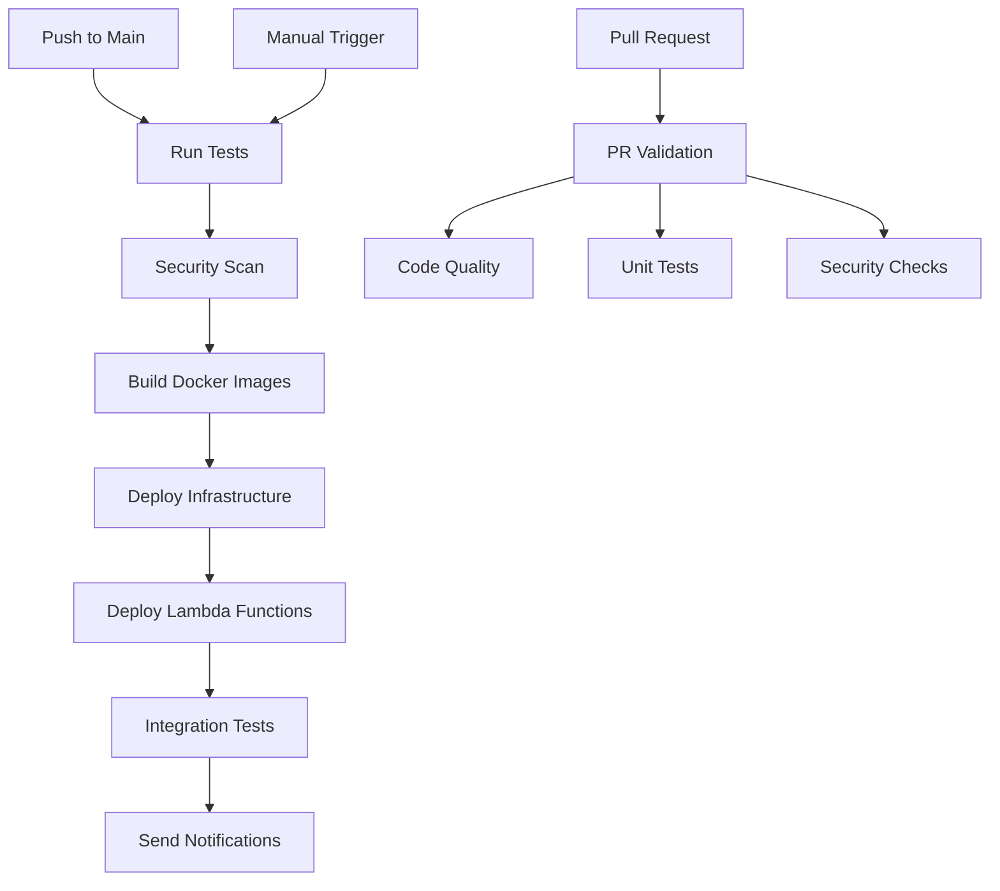

# 🚀 GitHub Actions CI/CD Documentation

## Overview

This repository uses GitHub Actions for continuous integration and deployment to AWS. The pipeline includes automated testing, security scanning, infrastructure deployment, and Lambda function updates.

## 📁 Workflow Files

### 1. **main-deploy.yml** - Main CI/CD Pipeline
- **Trigger**: Push to main/develop, manual dispatch
- **Purpose**: Complete deployment pipeline
- **Jobs**:
  - ✅ Run tests and linting
  - 🔒 Security scanning (Trivy, Checkov)
  - 🐳 Build and push Docker images
  - 🏗️ Deploy infrastructure with Terraform
  - ⚡ Deploy Lambda functions
  - 🧪 Run integration tests

### 2. **terraform-deploy.yml** - Infrastructure Management
- **Trigger**: Manual dispatch only
- **Purpose**: Manage Terraform infrastructure
- **Actions**:
  - `plan` - Preview infrastructure changes
  - `apply` - Apply infrastructure changes
  - `destroy` - Destroy infrastructure
- **Environments**: mvp, staging, production

### 3. **lambda-deploy.yml** - Lambda Function Deployment
- **Trigger**: Changes to Lambda code, manual dispatch
- **Purpose**: Deploy individual Lambda functions
- **Features**:
  - Auto-detects changed Lambda functions
  - Parallel deployment of multiple agents
  - Health check validation
  - Integration testing

### 4. **pr-validation.yml** - Pull Request Checks
- **Trigger**: Pull request events
- **Purpose**: Validate code quality before merge
- **Checks**:
  - 🎨 Code formatting (Black, isort)
  - 🔍 Linting (Flake8, Pylint)
  - 🔒 Security scanning
  - ✅ Unit tests
  - 📏 Terraform validation
  - 📊 PR size check

## 🔐 Required GitHub Secrets

Before running the workflows, configure these secrets:

```bash
# Run the setup script
./setup-github-secrets.sh
```

### Repository Secrets:
- `AWS_ACCESS_KEY_ID` - AWS access key
- `AWS_SECRET_ACCESS_KEY` - AWS secret key
- `AWS_ACCOUNT_ID` - AWS account ID
- `ALERT_EMAIL` - Email for alerts
- `AGENTOPS_API_KEY` - AgentOps API key
- `GH_TOKEN` - GitHub token (auto-configured)
- `SLACK_WEBHOOK` - Slack webhook URL (optional)

## 🌍 Environments

The workflows support three environments:

### **mvp** (Default)
- Minimal cost configuration
- Auto-approval for deployments
- Used for development/testing

### **staging**
- Pre-production environment
- Mirrors production configuration
- Manual approval required

### **production**
- Production environment
- Requires manual approval
- Protected branch policies
- 5-minute deployment delay

## 📋 Common Operations

### Deploy Infrastructure

```bash
# Plan changes
gh workflow run terraform-deploy.yml \
  -f action=plan \
  -f environment=mvp

# Apply changes
gh workflow run terraform-deploy.yml \
  -f action=apply \
  -f environment=mvp \
  -f auto_approve=true
```

### Deploy Lambda Functions

```bash
# Deploy all Lambda functions
gh workflow run lambda-deploy.yml \
  -f environment=mvp \
  -f agents=all

# Deploy specific agents
gh workflow run lambda-deploy.yml \
  -f environment=mvp \
  -f agents="manager,engineer,qa"
```

### Full Deployment

```bash
# Trigger complete deployment pipeline
gh workflow run main-deploy.yml \
  -f environment=mvp
```

### Check Workflow Status

```bash
# List recent workflow runs
gh run list

# Watch a specific run
gh run watch

# View workflow logs
gh run view --log
```

## 🔄 Deployment Flow



## 🧪 Testing

### Local Testing

Before pushing, test locally:

```bash
# Run linting
black . --check
flake8 .

# Run tests
pytest tests/

# Validate Terraform
cd terraform
terraform fmt -check
terraform validate
```

### PR Testing

All pull requests automatically run:
1. Code formatting checks
2. Linting
3. Security scanning
4. Unit tests
5. Terraform validation

## 🚨 Troubleshooting

### Common Issues

#### 1. AWS Credentials Error
```bash
# Verify secrets are set
gh secret list

# Re-run setup
./setup-github-secrets.sh
```

#### 2. Terraform State Lock
```bash
# Force unlock (use with caution)
terraform force-unlock <lock-id>
```

#### 3. Lambda Deployment Fails
```bash
# Check function exists
aws lambda get-function \
  --function-name cabruca-mvp-mvp-manager-agent \
  --region sa-east-1

# Check logs
aws logs tail /aws/lambda/cabruca-mvp-mvp-manager-agent \
  --region sa-east-1 --follow
```

#### 4. Workflow Fails
```bash
# Re-run failed jobs
gh run rerun <run-id> --failed

# View detailed logs
gh run view <run-id> --log
```

## 📊 Monitoring Deployments

### GitHub Actions Dashboard
- View at: `https://github.com/<owner>/<repo>/actions`
- Monitor workflow runs
- Check deployment history

### AWS CloudWatch
- Lambda function logs
- Deployment metrics
- Error tracking

### Slack Notifications
- Configure `SLACK_WEBHOOK` secret
- Receive deployment status updates
- Get error alerts

## 🔒 Security Best Practices

1. **Secrets Management**
   - Never commit secrets to code
   - Use GitHub Secrets for sensitive data
   - Rotate credentials regularly

2. **Environment Protection**
   - Production requires manual approval
   - Staging has deployment delays
   - Use branch protection rules

3. **Security Scanning**
   - Trivy scans for vulnerabilities
   - Checkov validates IaC security
   - Trufflehog detects secrets

4. **Access Control**
   - Limit who can trigger deployments
   - Use environment-specific permissions
   - Audit deployment logs

## 📈 Cost Optimization

The workflows include cost-saving features:

- **Conditional Deployments**: Only deploy what changed
- **Caching**: Dependencies cached between runs
- **Parallel Jobs**: Faster execution, lower costs
- **Auto-shutdown**: Dev environments shut down after hours

## 🔄 Rollback Procedures

If deployment fails:

### 1. Rollback Infrastructure
```bash
# Revert to previous state
cd terraform
terraform apply -target=<previous-resource>
```

### 2. Rollback Lambda
```bash
# Deploy previous version
aws lambda update-function-code \
  --function-name <function> \
  --s3-bucket <bucket> \
  --s3-key <previous-version>
```

### 3. Revert Git Changes
```bash
# Revert commit
git revert <commit-hash>
git push
```

## 📚 Additional Resources

- [GitHub Actions Documentation](https://docs.github.com/en/actions)
- [AWS Lambda Deployment](https://docs.aws.amazon.com/lambda/latest/dg/lambda-deploy-functions.html)
- [Terraform Best Practices](https://www.terraform.io/docs/cloud/guides/recommended-practices/index.html)
- [AgentOps Documentation](https://docs.agentops.ai)

## 🤝 Contributing

1. Create a feature branch
2. Make changes
3. Open a pull request
4. Wait for automated checks
5. Get approval from maintainers
6. Merge to main (auto-deploys to staging)

## 📧 Support

For issues with deployments:
1. Check workflow logs
2. Review this documentation
3. Contact the DevOps team
4. Open an issue in the repository