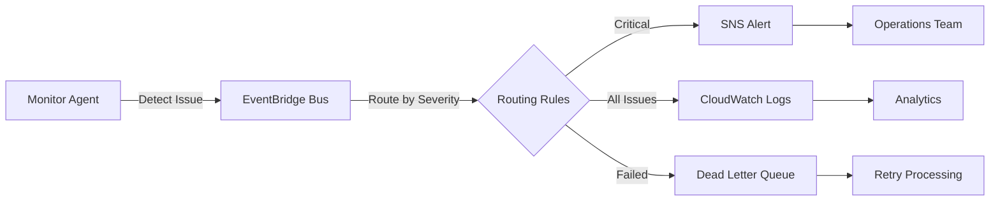

# EventBridge Agent Communication Infrastructure

## Overview

This module provides a complete AWS EventBridge infrastructure for multi-agent communication in the Cabruca Segmentation system. It enables autonomous agents to communicate asynchronously through a custom event bus with defined schemas, routing rules, and dead letter queues.

## Architecture Components

### 1. Custom Event Bus
- **Name**: `cabruca-agents-bus`
- **Purpose**: Dedicated bus for agent-to-agent communication
- **Isolation**: Separate from default AWS event bus to avoid interference

### 2. Event Schemas
Four primary event types are defined with OpenAPI 3.0 schemas:

#### Issue Detection Event
- **Source**: `cabruca.agents.monitor`
- **Use Case**: Monitoring agents reporting system issues
- **Fields**: severity, issue type, affected resources, metrics, suggested actions

#### Feature Request Event
- **Source**: `cabruca.agents.product`
- **Use Case**: Product agents requesting new features
- **Fields**: priority, feature type, business justification, estimated impact

#### Code Change Event
- **Source**: `cabruca.agents.developer`
- **Use Case**: Developer agents reporting code modifications
- **Fields**: repository, branch, change type, status, test results

#### Test Results Event
- **Source**: `cabruca.agents.tester`
- **Use Case**: Testing agents reporting test execution results
- **Fields**: test type, status, coverage metrics, failed tests, artifacts

### 3. Event Routing Rules
Six routing rules for intelligent event distribution:

1. **Issue Detection Routing**: Routes all issue events to logging
2. **Critical Issues**: Routes HIGH/CRITICAL severity to SNS alerts
3. **Feature Request Routing**: Routes to product management queue
4. **Code Change Routing**: Routes approved changes to CI/CD
5. **Test Results Routing**: Routes all test results for tracking
6. **Failed Tests**: Routes failed tests for immediate investigation

### 4. Dead Letter Queues (DLQ)
Two SQS queues for handling failed events:

- **Standard DLQ**: 14-day retention for general failures
- **Critical DLQ**: 4-day retention for high-priority failures

### 5. Monitoring & Cost Control
- CloudWatch dashboard for event metrics
- Cost alarm when approaching $10/month limit
- Event archive for 7-day retention

## Cost Optimization Strategy

### Pricing Breakdown
- **Custom Events**: $1.00 per million events published
- **Rule Matches**: $0.64 per million events matched
- **Total Cost**: ~$1.64 per million events

### Staying Under $10/Month
To stay under the $10/month budget:
- **Maximum Events**: ~6 million events/month
- **Daily Limit**: ~200,000 events/day
- **Hourly Limit**: ~8,300 events/hour

### Cost Control Measures

1. **Event Batching**: Agents should batch events when possible
2. **Smart Filtering**: Use precise event patterns to reduce rule matches
3. **Log Retention**: 7-day retention for logs (minimal cost)
4. **DLQ Strategy**: Use SQS long polling to reduce API calls
5. **Monitoring Alert**: Alarm triggers at 90% of budget (9M events)

### Event Volume Guidelines

| Agent Type | Max Events/Day | Max Events/Hour | Use Case |
|------------|---------------|-----------------|----------|
| Monitor | 50,000 | 2,100 | System monitoring |
| Product | 5,000 | 200 | Feature requests |
| Developer | 20,000 | 850 | Code changes |
| Tester | 30,000 | 1,250 | Test results |
| **Total** | **105,000** | **4,400** | All agents |

## Deployment

### Prerequisites
- Terraform >= 1.0
- AWS CLI configured
- AWS account with appropriate permissions

### Deploy Infrastructure
```bash
cd terraform

# Initialize Terraform
terraform init

# Review planned changes
terraform plan

# Apply infrastructure
terraform apply

# Get outputs
terraform output
```

### Important Outputs
- `event_bus_name`: Name of the custom event bus
- `event_bus_arn`: ARN for IAM policies
- `schema_registry_name`: Schema registry for validation
- `dlq_url`: Dead letter queue URL
- `agent_event_publisher_policy_arn`: IAM policy for agents

## Agent Integration

### Python SDK Example
```python
from eventbridge_agent_example import EventBridgeAgent, IssueDetectionEvent, Severity, IssueType

# Initialize agent
agent = EventBridgeAgent(agent_id="monitor-001")

# Create and publish event
issue = IssueDetectionEvent.create(
    agent_id="monitor-001",
    severity=Severity.HIGH,
    issue_type=IssueType.PERFORMANCE,
    description="High API latency detected"
)

result = agent.publish_issue_detection(issue)
```

### IAM Permissions
Agents need the following IAM policy attached:
```json
{
  "Version": "2012-10-17",
  "Statement": [
    {
      "Effect": "Allow",
      "Action": "events:PutEvents",
      "Resource": "arn:aws:events:sa-east-1:*:event-bus/cabruca-agents-bus"
    }
  ]
}
```

## Event Flow Example



## Best Practices

### 1. Event Design
- Keep events small (<256 KB)
- Use consistent field naming
- Include correlation IDs for tracing
- Add timestamps in ISO 8601 format

### 2. Error Handling
- Implement exponential backoff
- Use DLQ for failed events
- Monitor failure rates
- Set up alerts for critical failures

### 3. Security
- Use IAM roles, not access keys
- Encrypt sensitive data in events
- Audit event access with CloudTrail
- Rotate credentials regularly

### 4. Performance
- Batch events when possible (up to 10 per request)
- Use event filtering to reduce processing
- Cache schema validations
- Monitor latency metrics

## Monitoring

### Key Metrics to Track
1. **Event Volume**
   - Total events published
   - Events per agent
   - Peak hourly rate

2. **Success Rate**
   - Successful rule matches
   - Failed invocations
   - DLQ messages

3. **Latency**
   - Event publishing time
   - Rule evaluation time
   - End-to-end processing time

4. **Costs**
   - Monthly event count
   - Projected monthly cost
   - Cost per agent type

### CloudWatch Dashboard
Access the monitoring dashboard:
```bash
aws cloudwatch get-dashboard \
  --dashboard-name cabruca-segmentation-prod-eventbridge-dashboard \
  --region sa-east-1
```

## Troubleshooting

### Common Issues

1. **Events Not Being Received**
   - Check IAM permissions
   - Verify event bus name
   - Review event pattern matching
   - Check CloudWatch Logs for errors

2. **High Costs**
   - Review event volume metrics
   - Implement event batching
   - Filter unnecessary events
   - Consider event sampling for non-critical data

3. **DLQ Messages Accumulating**
   - Check target service availability
   - Review error messages in DLQ
   - Verify event schema compliance
   - Check retry configuration

4. **Schema Validation Failures**
   - Ensure events match defined schemas
   - Check for required fields
   - Validate data types
   - Review schema versioning

## Testing

### Unit Tests
```bash
# Run Python tests
python -m pytest tests/test_eventbridge_agent.py
```

### Integration Tests
```bash
# Publish test event
aws events put-events \
  --entries file://test-event.json \
  --region sa-east-1
```

### Load Testing
```bash
# Simulate agent load
python scripts/eventbridge_load_test.py \
  --agents 10 \
  --events-per-agent 1000 \
  --duration 60
```

## Maintenance

### Regular Tasks
- **Weekly**: Review DLQ messages
- **Monthly**: Analyze cost trends
- **Quarterly**: Update event schemas
- **Annually**: Review retention policies

### Scaling Considerations
If event volume exceeds 6M/month:
1. Implement event sampling
2. Increase budget allocation
3. Optimize event patterns
4. Consider alternative architectures (Kinesis, SQS)

## Support

For issues or questions:
1. Check CloudWatch Logs: `/aws/events/cabruca-segmentation-prod/agents`
2. Review CloudWatch Metrics: `AWS/Events` namespace
3. Monitor SNS Topic: `cabruca-segmentation-prod-critical-alerts`
4. Check DLQ: `cabruca-segmentation-prod-eventbridge-dlq`

## License

This infrastructure is part of the Cabruca Segmentation project and follows the project's licensing terms.
